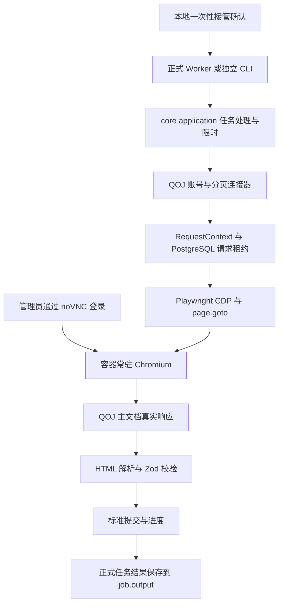

# QOJ 采集流程与技术维护

更新日期：2026-10-02，时间统一使用北京时间（Asia/Shanghai）。本文供运行采集任务的管理员和维护代码的开发者使用，说明当前 QOJ 个人原始提交采集的操作、实现、结果判断和故障处理。解析细节见 [QOJ 连接器 README](../packages/connectors/src/qoj/README.md)，统一 API、限流和失败恢复见[采集架构](采集架构与管理API.md)，历史实测见[归档记录](archive/2026-10-02-QOJ验收.md)。

**运行原则：保持专用容器浏览器运行，管理员完成登录，后续脚本复用这个浏览器的现有会话。QOJ CDP 模式不自动导入数据库 Cookie，也不把密文 Cookie 恢复作为运行前提。** 日常采集不需要重新登录；容器重建、浏览器退出或站点会话失效后，需要重新人工登录。

## 日常读取流程

当前默认入口为 [管理员连接页](http://localhost:3000/admin/connections)，页面内嵌 noVNC，登录后点击身份核验；默认 Compose 不再要求 CLI 接管确认。初次部署暂停提交采集，管理员完成登录并确认后才启用，详见[个人后端与 Web 登录](个人后端与Web登录.md)。下面 CLI 命令用于启用后的诊断读取，状态文件和 job.output 不替代正式个人同步的数据库游标。本文后面的人工启动/接管段属于旧维护模式，默认 Compose 固定关闭该模式；如需维护使用，须显式增加独立覆盖配置。

所有命令在仓库根目录执行；以下用容器内的 Node.js 和 pnpm。命令要求已部署包含公共采集接口的新版本及匹配迁移。

### 使用当前登录浏览器

先查看容器与任务日志，了解当前读取或人工处理状态：

```powershell
docker ps --format '{{.Names}} {{.Status}}'
docker logs --tail 20 acm-leaderboard-worker-1
```

当前浏览器已登录时，可直接执行两页读取：

```powershell
docker exec acm-leaderboard-worker-1 pnpm qoj:debug --browser --browser-cdp http://127.0.0.1:9222 --target muhammad --pages 2 --human-retries 0 --http-diagnostics
```

`--browser-cdp` 必须明确提供：容器启动脚本把 CDP 地址注入常驻 Worker 的子进程，后续 `docker exec` 进程不自动继承这次运行时注入的环境。省略该参数可能启动另一个浏览器，不能当成复用当前会话。

命令结束会关闭脚本创建的采集页、断开其 CDP 连接，并保留容器拥有的 Chromium 与登录状态。`--human-retries 0` 在遇到登录或挑战时返回结果，不停在重复人工等待中；这不会自动完成验证。

直接 CLI 输出 `qoj_page` 的统计与少量样本、最终 `qoj_scan` 的公共摘要，并保存数据库运行记录。需要保存完整标准记录时，使用正式队列，其结果进入 PostgreSQL 的 job.output；`--memory` 是不持久化的显式调试模式。

### 使用正式 Worker 队列

常驻 Worker 已确认接管且当前空闲时，投递任务：

```powershell
docker exec acm-leaderboard-worker-1 pnpm qoj:debug --enqueue --target muhammad --pages 2 --duration-ms 300000
docker logs --tail 20 acm-leaderboard-worker-1
```

投递命令返回 `qoj_read_enqueued.jobId`，只证明任务入队。完成后查找同一 jobId 的 `platform_worker_read`，核对业务 status、progress、stopReason 和 historyComplete，也可用管理员 API 查询 runId。任务的完整标准提交与题目保存在队列 output；调试 CLI 和正式 Worker 使用同一个应用处理器。

正式队列和持久化 CLI 通过数据库连接任务租约串行操作同一个 connectionId，等待也受总预算约束。建议日常使用队列；`--memory` 调试不获得正式连接租约，应只在该浏览器空闲时执行。管理员也不要在采集进行中通过 noVNC 导航、退出账号或关闭采集页面。

## 新环境启动与人工登录

这部分用于首次部署或明确接受会话丢失后的维护操作。已有登录现场时，直接使用上一节的读取命令；不要为每次采集运行 compose up、restart 或重新创建容器。

### 准备应用和浏览器镜像

首次安装按根 [README](../README.md) 完成配置、数据库迁移和管理员引导。`setup` 保留已有 Secret，不输出密码。默认直接拉取浏览器镜像：

```powershell
node scripts/setup.mjs
docker compose -f compose.yaml -f compose.qoj-browser.yaml pull
docker compose -f compose.yaml -f compose.qoj-browser.yaml up -d --wait
```

普通 runtime 镜像不包含 Chromium。自行构建时追加 `compose.build.yaml` 与 `compose.qoj-browser.build.yaml`，顺序见[部署与运维](部署与运维.md)。拉取或构建新镜像本身不会替换正在运行的容器；后续 up/recreate 才是部署动作。涉及数据库迁移时先暂停采集、备份并停止旧 worker，再部署匹配版本。

### 启动未接管的专用浏览器

旧维护模式需要显式覆盖 Compose 固定的启动设置。在 `.local/qoj-manual.compose.yaml` 写入以下内容：

```yaml
services:
  worker:
    environment:
      QOJ_BROWSER_MANUAL_START: "true"
      QOJ_BROWSER_START_TARGET: muhammad
      QOJ_HUMAN_RETRIES: "0"
```

再启动尚未接管的 Worker：

```powershell
docker compose -f compose.yaml -f compose.qoj-browser.yaml -f .local/qoj-manual.compose.yaml up -d --no-deps --no-build worker
docker logs --tail 10 acm-leaderboard-worker-1
```

这里的 `--no-deps` 要求应用依赖已准备好，不代替首次数据库初始化。源码部署还需按 README 追加两份 build 配置，并把上述维护配置放在最后。后续管理该实例时保留同样的配置组合；只设置宿主环境变量不会覆盖 Compose 固定值。

容器启动 Chromium 并打开目标主页，同时产生 `qoj_browser_manual_start` 事件。常驻 Worker 在消费本次确认前不连接 CDP。记录事件 id 和 expiresAt，接管事件有效期为 10 分钟。

### 人工登录与确认接管

1. 在管理员自己的浏览器打开 [noVNC](http://127.0.0.1:6080/vnc.html?autoconnect=1&resize=scale)。远程服务器先建立 SSH 隧道，例如 `ssh -L 6080:127.0.0.1:6080 管理员@服务器`。
2. 从服务器受保护的 `.secrets/qoj-vnc-password` 本地读取 VNC 密码并手动输入。不要发送密码、把密码放入 URL，或在日志中展示它。
3. 在远程桌面的专用 Chromium 登录采集账号。采集账号与目标 muhammad 可以不同；不要求目标账号密码。
4. 确认真正来到正常 QOJ 页面后，用日志里的本次事件 UUID 执行：

```powershell
docker exec acm-leaderboard-worker-1 pnpm qoj:confirm --attach --id 当前事件UUID
docker exec acm-leaderboard-worker-1 pnpm qoj:debug --enqueue --target muhammad --pages 2 --duration-ms 300000
```

`--attach` 用于启动时的接管事件，与读取期间的人工挑战确认不同。Worker 消费后删除确认文件，重新请求 `/` 核验采集身份，再重新请求目标主页和提交 URL。确认命令成功不等于登录验证或采集成功，最后仍要检查 Worker 结果。

事件过期、已消费或 UUID 不匹配时，不能拿旧 id 重新确认。尚未接管且事件过期时，需要重新启动专用容器获得新事件；该操作会丢失旧浏览器会话。已经成功接管的 Worker 不需要在每个任务前重复确认。

遇到持续循环的 Cloudflare 页面时停止重复点击；等待一个新的可操作登录页面或处理部署环境问题。延迟接管曾实测成功，但不保证每次都通过。

## 读取失败后的恢复

管理员从 `GET /api/admin/read-runs` 查询失败状态和 error.action。任务仍在等待人工处理时，在 noVNC 登录或完成挑战，再用 `pnpm qoj:confirm --id 当前挑战UUID` 确认；该命令不加启动接管的 `--attach`。

任务已经结束时，先完成专用浏览器登录，再调用 `POST /api/admin/connections/qoj/verify`，JSON 为 `{"target":"可读取目标"}`。接口需要管理员会话、Origin 和 CSRF token，返回 202 表示核验已入队。核验成功后推进连接 generation，worker 每 15 秒扫描并重投待鉴权请求；同一核验版本最多恢复一次。其他错误由管理员按错误动作手动重试或修复。

## 翻页回填与增量

### 回填与续跑

直接 CLI 可逐页保存进度：

```powershell
docker exec acm-leaderboard-worker-1 pnpm qoj:debug --browser --browser-cdp http://127.0.0.1:9222 --target muhammad --mode backfill --pages 2 --duration-ms 300000 --human-retries 0 --state /app/.local/qoj-backfill.json
```

再次执行同一命令，会从成功保存的 cursor 继续，边界重读上一页。需要一次读取更多页时，可调整 `--pages`；单批最多 1000 页、任务总预算最多 900000 ms。例如 `--pages 100 --duration-ms 900000` 仍可能因网络、挑战或预算提前停止。

状态文件只含 target、mode、cursor、checkpoint，不包含提交数组或登录秘密。它位于容器 tmpfs，重建时丢失。需要长期保留进度时，在任务结束后导出到宿主受控目录；`.local` 被 git/dockerignore 排除，不能把它当成版本管理或自动备份。

正式队列任务的 continuation 在 job.output.continuation.cursor/checkpoint 中；应用目前不会自动写入上述 CLI 状态文件，也没有通用自动续投调度器。续投需读取已完成 job 的 output，把 cursor/checkpoint 放入新任务。连接器不允许跳过失败页。

完成的回填状态 cursor=null。不要重复使用它来声称“从末页继续”或“做增量”；增量使用独立状态和上次完成的 checkpoint。

### 增量读取

`--checkpoint` 文件仅接受 `{version, data}`，不能传整个回填状态或完整 job.output。准备已完成扫描返回的 checkpoint 文件后，可执行：

```powershell
docker exec acm-leaderboard-worker-1 pnpm qoj:debug --browser --browser-cdp http://127.0.0.1:9222 --target muhammad --mode incremental --pages 3 --duration-ms 120000 --human-retries 0 --checkpoint /app/.local/qoj-checkpoint.json --state /app/.local/qoj-incremental.json
```

路径是示例，部署时必须先准备合法 checkpoint。增量跨过锚点后再读完整一页，才返回 checkpoint_reached。一次新的增量应从顶部开始，使用上次完成的 checkpoint；中断续跑才沿用未完成增量的 cursor。

### 判断结果

| 结果 | 含义和处理 |
| --- | --- |
| status=completed，stopReason=more | 本批读页成功，但尚未读完。保留 cursor 续跑。 |
| stopReason=history_end，historyComplete=true | 正常末页确认通过，该身份当前可见历史结束。 |
| stopReason=checkpoint_reached | 本轮增量结束，不等于历史回填结束。 |
| status=human_input_required / auth_required | 需要真实登录或挑战处理。此前成功页保留。 |
| status=timeout / cancelled | 本批结束。失败页不推进；正式失败重试从原批次输入开始。 |
| status=parse_changed / restricted / failed | 检查具体 code 和响应分类，不能当成空页或历史结束。 |

数据库记录的逐页 continuation 是诊断进度，不能当成已写入正式提交事实。管理员重试及鉴权恢复会重放原批次输入；只有调用方已保存对应事实的工件才可按其游标续跑。

`recordsWithOverlap` 包含边界重读，不能直接相加当唯一提交数。跨批次合并按 externalSubmissionId 去重；题目按 problemKey 去重。pg-boss 的 completed 状态不代替上述业务判断。

## 技术架构与会话生命周期



### 进程归属

容器启动脚本拥有 Xvfb、Openbox、VNC/noVNC、Chromium 和常驻 Worker。浏览器不是每个任务重新启动的进程；Worker 复用默认 context，独立 CLI 连接同一 CDP endpoint 后创建自己的采集页。

| 操作 | 对浏览器会话的影响 |
| --- | --- |
| 一次独立 CLI 正常结束 | 关闭该脚本采集页、断开 CDP，浏览器继续运行。 |
| 取消单项队列任务 | 结束等待或采集页，释放任务锁；浏览器 context 保留。 |
| 构建新镜像 | 不影响当前容器，当前进程仍使用已加载的代码。 |
| 关闭外部默认 BrowserContext | 可能终止持久浏览器，代码中禁止这样处理。 |
| 常驻 Worker 或桌面辅助进程退出 | 当前监督脚本停止容器内其余进程，可能随容器重启失去会话。 |
| compose restart、容器停止或重建 | 不承诺保留会话，应重新人工登录。 |

不能通过杀掉常驻 Worker 来实现“只重载 Worker、保持浏览器”。当前监督进程将其视为子进程退出，随后结束浏览器。新源码复制进容器也不会热替换已经加载的 Worker 模块；新的独立脚本进程才读取修改后的源码。

### 会话与网络边界

CDP 仅在容器内 `127.0.0.1:9222` 监听，不向宿主或公网发布。6080 只发布宿主回环，远程使用 SSH 隧道；原始 VNC 5900 只监听容器回环。noVNC 目前没有接入本站管理员会话鉴权，也没有自动按任务状态禁用输入。

专用浏览器 profile 位于 `/tmp/qoj-browser/profile`，与 `/app/.local`、`/app/apps/worker/.local` 一起使用 tmpfs。运行期间保留浏览器状态；容器停止或重建后不作持久化保证。不使用用户日常浏览器目录或明文 storageState 文件。

CDP 读取保持实际浏览器身份，不覆盖 UA，也不清空或导入数据库 Cookie 快照。成功响应仍保留原有 AES-GCM 加密 Cookie 写回能力，密钥来自 Secret；这不是 CDP 恢复依赖。独立启动浏览器和 Node jar 模式仍有旧的恢复能力，当前运行流程不依赖它们。

容器为非 root node 用户、cap_drop=ALL、共享内存 1 GiB；Chromium 使用 --no-sandbox，不能把容器隔离称为 Chromium 内部 sandbox 加固。tmpfs 不等于加密，服务器还需保护 swap、内存快照和 Secret。密码、Cookie、验证码与原始页面秘密不进入任务、日志、命令参数或 fixture。

## 数据规则与维护入口

只采目标个人原始提交，当前不采源代码、队伍或 VP。请求仅带 submitter/page，校验最终 URL、目标筛选、行内作者和 active 页码。每页 10 条，滑动分页窗口不是总页数；越界钳制不能当正常读取。末页必须有正确表头、active 页及 disabled 且无 href 的 next 控件。

提交 ID、题目 ID 保存字符串；时间从 `<time datetime>` 显式时区转 UTC，QOJ 样本为 +08:00；难度固定 null。保留所有原生结果与分数，100 分本身不当 AC，明确 Accepted/✓ 才判 accepted。主页无时间的通过题只核对缺口，不生成提交或首次 AC。

每条结果经 Zod 校验，保留 parserVersion/observedAt。cursor/checkpoint 绑定账号、模式和解析版本；更改解析规则时评估版本兼容及重扫位置，不能静默复用不兼容游标。

| 维护内容 | 文件入口 |
| --- | --- |
| 浏览器启动、桌面与进程监督 | [qoj-container.mjs](../scripts/qoj-container.mjs)、[Dockerfile](../Dockerfile)、[Compose 覆盖配置](../compose.qoj-browser.yaml) |
| CDP、真实导航、会话和断开 | [qoj-browser.ts](../packages/core/src/application/platforms/qoj/browser.ts) |
| 任务锁、预算、人工处理与结果 | [qoj-worker.ts](../packages/core/src/application/platforms/qoj/worker.ts) |
| 一次性接管确认 | [qoj-browser-attach.ts](../packages/core/src/application/platforms/qoj/browser-attach.ts)、[qoj-confirm.ts](../scripts/qoj-confirm.ts) |
| HTTP 配额、超时、重试和取消 | [request-context.ts](../packages/core/src/application/collection/request-context.ts) |
| 账号、分页与归一化解析 | [连接器](../packages/connectors/src/qoj/index.ts)、[parser.ts](../packages/connectors/src/qoj/parser.ts)、[http.ts](../packages/connectors/src/qoj/http.ts) |
| 队列消费与调试参数 | [Worker 入口](../apps/worker/src/runtime/start.ts)、[qoj-debug.ts](../apps/worker/src/cli/qoj-debug.ts) |
| 环境参数与取值校验 | [.env.example](../.env.example)、[config.ts](../packages/core/src/application/config.ts) |

## 配置与故障处理

| 配置 | 用途或默认值 |
| --- | --- |
| QOJ_TRANSPORT / QOJ_CONNECTION_ID | browser / qoj-lab（浏览器 Compose 设置）。 |
| QOJ_BROWSER_MANUAL_START | 默认为 false；新会话人工登录流程设 true，确认前不接管。 |
| QOJ_BROWSER_START_TARGET | 未接管浏览器的首个主页目标，默认 muhammad。 |
| QOJ_MIN_INTERVAL_MS | 默认 3000，仅迁移初始化缺失策略；实际间隔范围通过数据库管理 API 调整。 |
| QOJ_HTTP_TIMEOUT_MS / QOJ_HTTP_RETRIES | 默认 30000 / 2。 |
| QOJ_HUMAN_TIMEOUT_MS / QOJ_HUMAN_RETRIES | 默认 120000 / 2；已知循环排查使用0次人工重试。 |
| QOJ_HUMAN_CONFIRM_FILE | 读取期间的人工确认文件，Compose 为 /app/.local/qoj-confirm.json。 |
| QOJ_BROWSER_PROXY_SERVER | 可选标准代理 endpoint，不能带凭据、路径、查询或 fragment。 |
| QOJ_DESKTOP_PORT | 默认宿主回环6080。 |

QOJ_LOGIN_HANDLE 可在应用处理器中限制采集身份；当前浏览器 Compose 尚未显式转发此变量，部署时须先补入服务环境，不能以为宿主设置后已经生效。目标 --target 不是登录用户名。

| 现象 | 处理 |
| --- | --- |
| 读取显示正常登录页 | 在专用浏览器完成真实登录，再核验连接；不要把登录页当空列表。 |
| 新的可处理挑战 | 允许人工完成；读取等待事件用 qoj:confirm --id，启动接管事件才加 --attach。 |
| 同一 CF 页面持续循环 | 停止重复点击，保留失败进度；核对网络和专用浏览器环境，不使用 stealth、指纹伪造或自动解验证码。 |
| timeout / NETWORK_ERROR | 查浏览器能否真实访问、代理是否可达、任务预算是否足够；不靠无限提高重试掩盖故障。 |
| parse_changed | 检查表头、作者、页码、筛选、时间格式。只保存脱敏最小样本，修复解析并回归测试后续跑。 |
| Worker healthy 但没有成功记录 | 检查具体 jobId 的业务 output；健康状态和 completed 都不能证明采集成功。 |
| qoj_debug_failed | 检查参数、state目标/模式、checkpoint格式、Secret和CDP地址。先看配置，不重启已登录浏览器。 |
| CLI 已输出结果但不退出 | 核对是否使用有 CDP 断开修复的代码，不调用默认 context.close 或强杀浏览器。 |

`compose.qoj-browser.yaml` 默认启动内部 `qoj-relay`。它只允许到 QOJ 与 Cloudflare challenge 的 TLS CONNECT，不解密 TLS，也不接触密码或响应正文。如果 Docker 能建立 TCP 却无法完成 TLS，而宿主机代理可以访问，在 `.env` 设置 `QOJ_RELAY_UPSTREAM=http://host.docker.internal:7890`（端口按本机配置），执行 `docker compose -f compose.yaml -f compose.qoj-browser.yaml up -d --no-deps --force-recreate qoj-relay`。只替换中继，浏览器及已登录状态保留，然后刷新 QOJ 页面。中继脚本随镜像发布，代理连接超时或拒绝返回 502。

`QOJ_BROWSER_PROXY_SERVER` 用于替换 Chromium 本身的代理入口；修改它需要重启浏览器，应安排重新人工登录。优先通过 `QOJ_RELAY_UPSTREAM` 调整出口，宿主机代理必须保持运行。

取消单项正式任务应使用 pg-boss 的 `boss.cancel(QOJ_READ_QUEUE, jobId)`，由 job.signal 和 heartbeat 通知 Worker 释放页面；不要停止整个 Worker 容器。`pnpm qoj:cancel-probe` 会另建真实测试任务，不是取消任意现有 job 的命令。直接 CLI 可用交互式 Ctrl+C 取消；不要手动删除正在使用的 state 文件或确认文件。

## 更新代码与验收记录

维护前记录任务进度，确认没有在途读取，导出需要保留的标准记录和 checkpoint。浏览器 Cookie、密码和 storageState 不作为文档附件或备份文件。

新环境网络正常时可构建新镜像，再在独立一次性容器中检查，不替换当前登录浏览器：

```powershell
docker compose -f compose.yaml -f compose.build.yaml -f compose.qoj-browser.yaml -f compose.qoj-browser.build.yaml build worker
docker run --rm --entrypoint sh acm-leaderboard:qoj-browser -c 'mkdir -p "$TMPDIR" && pnpm check'
```

Dockerfile 的 build 阶段已执行 TypeScript 和 pnpm build。构建通过后，只有在接受当前会话丢失时才部署新容器，并重复人工登录与两页真实读取。文档改动只检查内容、路径、命令和 diff，不需要重建应用。

真实验收记录已迁至[历史归档](archive/2026-10-02-QOJ验收.md)，不代表当前部署状态。个人业务事实、持续增量、管理页内嵌远程桌面已实现，见[项目实现状态](项目实现状态.md)。真实会话失效后重登和密文 Cookie 恢复未完成验收；自动登录及 2FA 仍待实现。
