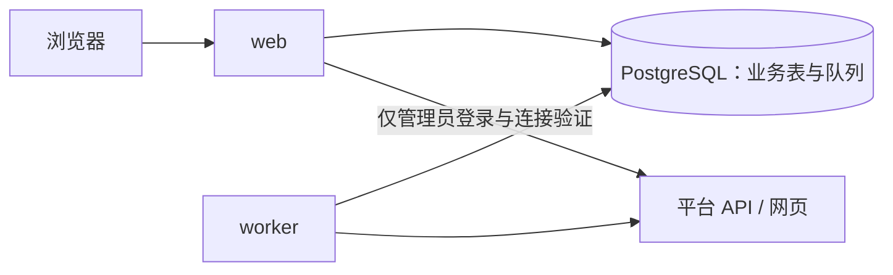

# ACM 实验室榜单：项目设计

版本：2026-10-01，设计修订 v3；实施更新：2026-10-04。本文描述完整产品目标，不作为已实现接口清单。认证、三平台个人绑定/同步/事实/查询和 Web 登录见[个人后端与 Web 登录](个人后端与Web登录.md)，成员页面与基础团队功能见[成员页面与团队榜](成员页面与团队榜.md)，平台/日期配置、周期同步、局部重爬和积分预览见[管理员采集管理](管理员采集管理.md)，公共读取与限流见[采集架构](采集架构与管理API.md)；启动见[README](../README.md)，历史验证见[归档索引](archive/README.md)。已实现与未实现逐项见[项目实现状态](项目实现状态.md)。独立比赛/VP、外站队伍绑定及归属纠正仍按阶段实施。

## 1. 目标与边界

### 用户与页面

| 角色 | 需要完成的事 |
| --- | --- |
| 成员 | 自行注册登录，绑定 Codeforces、QOJ、洛谷账号；查看个人题数、积分、做题时间与排名；自助创建队伍和选择本站队友。 |
| 管理员 | 维护用户、采集连接和同步任务，处理连接失效与错误；不逐场审核比赛或 VP。 |

默认部署在实验室内网或受控反向代理后，榜单需要登录。采用自报账号和队友的信任模式，只检查平台账号存在性和本站占用情况，不要求所有权证明或管理员审批。初版不做多租户、在线判题、自动提交代码、跨 OJ 题目等价识别，也不承诺实时同步。

1. **注册与资料**：用户名、密码注册，真实姓名自愿填写。显示名按“真实姓名 > 当前已验证 CF 用户名 > 本站用户名”读取时计算，不额外存一份可失步的显示名。
2. **个人榜单**：默认近 30 天，可选 7 天、自定义日期和平台；展示积分、首次 AC 题数、各平台题数、最近 AC 时间与数据完整性。
3. **个人详情**：首次 AC 日历/趋势、题目明细、原生难度、本站分值和原站链接；原始提交数另行展示。
4. **队伍**：创建者加 1—2 位本站队友，直接生效；相同成员集合只允许一个有效队伍。团队榜汇总当前成员在整个查询区间内的个人积分与题数，成员加入前的区间成绩也计入，退出后不再贡献。外站队伍、组队提交纠正及比赛/VP 展示后续实施。
5. **管理员页**：平台登录向导、连接状态、同步进度、手动更新和错误处理。尚未接通的平台不影响其他平台或整站使用。

### 榜单的统一口径

| 项目 | 规则 |
| --- | --- |
| 题目身份 | 使用平台内稳定题目键，不跨平台合并。没有稳定 ID 的记录显示“待识别”，不计分。 |
| 练习题数 | 个人按“成员 + 平台题目”去重，一题只计一次；团队题数为当前成员个人题数之和，同题被不同成员完成可分别贡献。CF 组队 AC 计入当场作者成员，积分按实际人数平均；其他平台组队暂不归个人。 |
| 首次 AC | 在**全部已采集的有效 AC** 中求最早提交时间，再筛选日期区间；不能先截取区间再求最早。回填和重判可能改变该时间。 |
| 区间 | 用户输入北京时间日期，首尾日期都包含；后端转为 UTC 的 `[起始日 00:00, 结束日次日 00:00)`。7/30 天包含今天。时间存 `timestamptz`，显示时使用 `Asia/Shanghai`。 |
| 提交数 | 原始提交按提交时间统计；重复采集、重判均不制造新提交。原站得分叫 `native_score`，本站积分叫 `points`。 |
| 积分 | 区间内首次 AC 的题目，按当前原生难度和当前生效的本站规则计分。默认未知难度 3 分；QOJ v1 默认 3 分。 |
| 排序 | 积分降序 → 题数降序 → 区间内最近 AC 时间降序；最后按主体 ID 稳定排列。前三项完全相同并列名次，采用 1、1、3 的排名。零题数成员也可见。 |
| 完整性 | 分平台显示最近成功同步时间、历史回填状态及权限缺口。回填未完时称“已采集记录中的首次 AC”，积分和名次标为暂定。同步时间不能证明历史完整。 |

**v2 计分规则**存为带版本号的 TypeScript 纯函数和分档配置，不引入规则引擎或数据库规则编辑器：

- Codeforces rating：`<1000 / 1000—1199 / 1200—1399 / 1400—1599 / 1600—1799 / 1800—1999 / 2000—2299 / 2300—2599 / 2600—2899 / ≥2900`，对应 `1 / 2 / 3 / 4 / 5 / 6 / 8 / 10 / 12 / 15` 分；无 rating 为 3 分。
- 洛谷按原设计采用的[八档难度](https://help.luogu.com.cn/manual/luogu/problem/difficulty)，从入门到 NOI/NOI+/CTS 对应 `1 / 2 / 3 / 5 / 8 / 10 / 12 / 15` 分；未知为 3 分。分档与平台难度 ID 的映射在接入时核对，不依赖颜色或标题字符串猜测。
- 例如首次 AC 一道 CF 1800 题、一道洛谷青题和一道未知难度 QOJ 题，合计 3 题、17 分（6 + 8 + 3）。

正式比赛、VP、普通练习中的个人 AC 都可以计入个人榜；VP 分类不决定计分主体。CF 组队 AC 按当场去重作者列表分摊至已验证绑定成员，每人所得为基础分 / 实际人数，未绑定或停用成员仍计入分母。每人同题只计首次 AC，后续个人 AC 不补分；ghost 或成员证据缺失、不一致不计分。团队榜采用成员个人积分合计，题数仍按成员相加。积分不先取整，页面最多显示三位小数。规则版本和题目难度更新时间同时展示；同一规则版本下，原站难度变化也会改变历史区间分数。v1 不承诺冻结历史榜单。

## 2. 技术栈与模块结构

| 层 | 选择 | 约束 |
| --- | --- | --- |
| 语言与包管理 | TypeScript、[Node.js 24 LTS](https://nodejs.org/en/about/previous-releases)、pnpm workspace | 固定补丁版本、pnpm 版本和锁文件，一个构建链。 |
| Web | Next.js App Router、Route Handlers | 页面和 API 共用业务服务；服务端页面直接调用查询服务，不通过 HTTP 调用自己的 API。 |
| 存储 | [PostgreSQL 17](https://www.postgresql.org/support/versioning/)、Drizzle ORM / drizzle-kit | 迁移进入版本库，唯一约束保证幂等；优先使用索引 SQL 查询。 |
| 采集 | 独立 Node.js worker、fetch、Cheerio、Zod | JSON/HTML 在连接器内转换为标准记录；只有实际登录流程要求时才引入浏览器自动化。 |
| 队列 | [pg-boss](https://github.com/timgit/pg-boss) | 使用 PostgreSQL 管队列，不新增 Redis；固定版本后验证去重、重试与迁移行为。 |
| UI | React、Tailwind CSS、轻量图表库 | 日期、平台元信息和榜单口径共用，图表库在实现时选定并锁版本。 |
| 认证 | Argon2id、本地账号、数据库会话、admin/member | 随机会话 token 仅以哈希存库；密码、会话和角色检查只在服务端。 |
| 部署 | Docker Compose、同一应用镜像 | 常驻 web、worker、db；一次性迁移和管理员引导。初版一个 worker。 |

### 三个共享包，两个运行入口

```text
apps/
  web/                       # 页面、HTTP 入参/鉴权、响应
  worker/                    # 队列调度/消费、进程生命周期
packages/
  core/
    domain/                  # 纯规则：归属、首次 AC、积分
    application/             # 用例：绑定、同步、登录、查询
  db/                        # schema、迁移、SQL 查询、持久化
  connectors/
    contracts/               # 平台无关标准记录、能力、错误
    codeforces/
    qoj/
    luogu/
    registry.ts              # 显式注册各平台
```

依赖方向为 `apps → core/application → db、connectors`；`core/domain` 只按需引用 `connectors/contracts` 的纯类型。db 和 connectors 不依赖 core，也不互相调用。core/application 负责业务决策和事务边界，db 负责执行查询和写入，connectors 负责平台请求及解析。连接器不写库、不投递队列、不决定分数或本站队伍归属。

core 分别导出浏览器可用的 `core/domain` 和服务端专用的 `core/server`；连接器也分开纯 contracts/元信息与服务端实现。禁止从客户端导入 db、Cookie 处理和服务端 registry，根入口不混合导出。领域规则不读取环境、数据库、网络或系统时间；所需规则、时间和证据作为参数传入。

应用服务直接调用具体 db helpers，不为每张表创建一层 repository/service。仅在确实出现替换需求时再抽接口；初版不引入事件总线、插件装载、通用工作流或统计缓存框架。



普通页面只读本地数据。账号存在性验证与同步均由 worker 执行；管理员登录必须在当前 web 请求内处理密码，其外站请求同样经过共享限速与会话控制。web 与 worker 不共享内存、Cookie 文件或本地缓存，跨请求状态写入 PostgreSQL。

### 新增能力时改哪里

| 扩展 | 需要修改 | 共用部分 |
| --- | --- | --- |
| 新平台 | 新连接器、解析样本、registry 元信息/能力、难度映射 | 同步编排、去重、首次 AC、榜单查询和通用资料控件 |
| 新积分规则 | 新版本配置/纯函数、分档边界测试 | 原始提交和归属；无需重新抓取历史提交 |
| 新平台登录步骤 | 对应登录适配器、步骤契约、流程样本 | 管理页渲染、attempt 存储、加密与权限校验 |
| 查询变慢 | 按实际执行计划增加索引，必要时物化首次 AC 投影 | 产品计分口径及原始事实 |

平台 ID 使用应用 registry 校验，数据库存文本，避免增加一个平台就修改多个数据库枚举。扩展能力以明确接口和配置完成；尚未支持的能力返回“不支持”，不伪造空数据。

## 3. 平台采集能力与规则

| 平台 | 初版数据源与能力 | 限制 |
| --- | --- | --- |
| Codeforces | 官方 `user.info`、`user.status`、`user.rating`；提交含参赛类型、成员和队伍线索 | 每 2 秒最多一次 API 请求；常规赛公开 `contest.standings` 只提供官方榜，不能借此获取 VP 名次。见[官方方法](https://codeforces.com/apiHelp/methods)、[对象](https://codeforces.com/apiHelp/objects)。 |
| QOJ | 登录后用户/队伍主页、提交和比赛页面；可见 VP 列表、队伍成员 | 未验证稳定公开 JSON API；当前队员名单不证明历史成员；未完成 VP 的最终名次未确认。 |
| 洛谷 | 登录后 `user/{uid}/practice`、`record/list?user={uid}&page={n}` 的内嵌数据 | 隐私限制可能影响可见范围；可靠 VP 和组队字段未验证，初版不提供这两项自动识别。 |

具体地址、已有验证和未验证部分统一见[实测附录](#9-平台数据获取实测附录)。通过题列表没有时间时，只用于核对缺口，不伪造提交或首次 AC 时间。

### 连接器契约

以下是目标接口示意；类型细节在实现时收敛。登录适配器与读取适配器分开，Codeforces 无需实现登录接口。

```ts
interface SubmissionPage {
  submissions: NormalizedSubmission[];
  problems: NormalizedProblem[];
  nextCursor: ConnectorCursor | null;
  stopReason: "more" | "history_end" | "checkpoint_reached";
  nextCheckpoint: ConnectorCheckpoint | null;
  coverage: "visible" | "restricted";
  sourceUrl: string;
  observedAt: string; // UTC
}

interface ReadConnector {
  capabilities: {
    submissions: boolean;
    participations: "none" | "partial" | "confirmed";
    teamEvidence: boolean;
  };
  resolveAccount(input: string, ctx: RequestContext): Promise<AccountRef>;
  fetchSubmissionPage(
    account: AccountRef,
    scan: {
      mode: "incremental" | "backfill";
      cursor: ConnectorCursor | null;
      checkpoint: ConnectorCheckpoint | null;
    },
    ctx: RequestContext
  ): Promise<SubmissionPage>;
  fetchProfile?(account: AccountRef, ctx: RequestContext): Promise<Profile>;
  fetchParticipations?(
    account: AccountRef,
    cursor: ConnectorCursor | null,
    ctx: RequestContext
  ): Promise<ParticipationPage>;
}
```

- `AccountRef` 显式包含平台、账号类型、规范化 handle/稳定外部 ID；ID 按字符串传递，避免不同平台数值范围造成精度丢失。规范化由各平台定义，不能统一假定用户名大小写规则。
- `RequestContext` 提供受控 HTTP、会话快照、取消信号和超时。每次实际 HTTP 请求均从该入口获取平台配额；登录、账号验证、分页和权限检查都不能绕过。
- cursor 和 checkpoint 是带版本的不透明 JSON，仅由所属连接器解释；core 不理解页码。每轮增量从 cursor=null 和上次完成的 checkpoint 开始；本轮中断只推进扫描 cursor，完整跨过重叠窗口后才更新 nextCheckpoint。回填独立续用自己的 cursor。解析版本不兼容时从安全位置重扫，依靠提交 ID 去重。
- 返回前做 Zod 校验。stopReason 区分继续翻页、可见历史结束和跨过增量锚点；后者只结束本轮增量，不代表历史回填完成。只有结构正常、目标匹配且明确识别终止页才能报告 history_end；正常空页可以成功，登录页、异常 HTML 或字段缺失必须报错。平台覆盖范围与本地回填进度分别记录。
- verdict 统一为 accepted / rejected / pending / unknown，由平台原始状态映射；不能只凭 native_score=100 判为 AC。缺失字段表示此次未观察到，不用其清空旧值；显式失效/清除必须有相应证据。
- 每条提交保留最小归属证据：作者账号键、当场成员、外站队伍 ID、比赛/参赛类型、可用的开始时间及来源。保存 `parser_version`、`observed_at`，不保存整页、源代码或平台秘密。

### 账号绑定与变更

保存资料时立即检查格式和本站占用，随后保存待验证候选并入队；页面即时显示“验证中”并查询进度。平台不可用是“暂不可验证”，不能当作账号不存在。验证通过后才启用绑定和历史回填；存在性验证不证明所有权。

每用户每平台最多一个生效个人账号和一个当前候选，验证失败/暂不可验证也属于该候选；重新提交替换候选并递增 binding_version。验证启用事务再次检查解析后的稳定身份及别名占用，不能只依赖保存前的预检查；已生效的同一身份按无变更处理。QOJ 队伍账号由队伍绑定，不允许作为个人账号计分。有稳定外部 ID 时以其为身份；无稳定 ID 时使用平台规范化账号和已证实别名。CF 改名可结合 `user.info` 的历史 handle 查询核对，[官方参数](https://codeforces.com/apiHelp/methods#user.info)不等于无条件允许合并任意新旧账号。

改名保持同一账号身份，替换是切换到另一账号。替换时先验证候选，成功后在一个事务里切换；失败时保留原生效账号。v1 采用**当前绑定决定该账号全部个人历史归属**：解绑/替换后旧账号不再贡献个人榜积分，资料页提前说明影响，不做绑定历史期间计分。切换、解绑或重新绑定时，按受影响外部身份重算全部已采集个人归属，不能只等待下一次增量页修复历史；组队事实仍按独立证据处理。旧任务携带 `account_id + binding_version`，提交前校验版本，不能把旧账号结果写到新绑定上。

解绑停止采集并撤销其个人归属；删除个人数据还需清理独属该用户的记录和秘密。多人共享的组队提交不直接整条删除，应移除该用户关联，保留其他成员的事实。审计摘要不保留已删除的个人敏感字段。

### 基础队伍管理与后续组队/VP 识别

基础队伍采用当前成员个人成绩合计。排序、日期、平台和首次 AC 与个人榜共用查询；成员关系保留加入/退出时间用于审计，不用于截断个人成绩。队伍归档后退出榜单，详情仍按保留成员与当前个人事实计算，名次为空。

当前 CF 组队采用成员分摊个人积分并进入团队汇总，无需先匹配本站队伍。以下外站主体直接归队、其他平台组队与独立 VP 识别仍为后续阶段目标，不能在成员分摊基础上再重复给队伍加分。

归属与 VP 分类是两个独立步骤；确认是个人 AC 即可计个人分，VP 类型未知不会丢分。归属优先顺序：

1. 已记录的人工纠正优先，自动同步不得覆盖。
2. 按当场外站队伍 ID/账号的有效绑定匹配；其次用提交中的完整成员集合匹配当时的站内队伍。只有一个候选才自动归队，不能按队名匹配。
3. 已知是多人/队伍提交但匹配不了本站队伍时，保持未归属；不能因为查询了某个成员就记给他。
4. 推测必须已有外站主体关联线索，再用同一比赛、接近开始时间和过题数核对。时间/数量相同本身不证明归属。唯一且无冲突的推测可计队伍分，显著标记“推测”；多候选或证据不足不计。
5. 普通单人提交才归给当前已验证绑定成员。洛谷暂不推测组队归属。

队伍 2—3 人、不得重复选择自己或同一队友，负责人必须是成员；成员可属于多个不同组合的队伍。有效队伍按排序后的成员 ID 集合唯一，重复或并发创建返回已有队伍，不修改队名和负责人。负责人可修改成员、转移创建权或归档；改人撞到已有组合时返回冲突。队员自行退出后不足 2 人或剩余组合重复时，原队伍自动归档，保留历史；归档后允许原组合重建。

成员关系与外站队伍绑定记录 `[valid_from, valid_to)`。普通改人从操作时刻生效，已有快照保留；历史回填不能用 QOJ 当前 Team Members 或本站创建时的队员倒推过去。早期提交仅凭当场证据、显式历史队伍绑定或有审计的用户纠正归队，没有依据时留空。

VP 优先采用平台标记或主页记录。推测 VP 要有可见开始时间、比赛时长和可对应提交；不能仅把赛后补题聚成 VP。过题数按一次参与的去重 AC 计算，不沿用全历史首次 AC 题数。未知名次保持 `null`；同一主体可多次 VP 同一比赛，不能只用“主体 + 比赛”去重。没有平台 participation ID 和稳定开始时间时，只保留提交上的 VP 标签，不制造独立参与记录或猜测单次参与过题数。

### 限速、增量与历史回填

**2026-10-03 已确认实施约定**：首次默认采集近 30 个北京时间日，固定日期下界且无固定上界；每批最多 3 页、120 秒，未完部分自动续跑。窗口完成后才发布持续增量检查点，后续从首页经过重叠窗口追赶，不受榜单查询日期约束。日期修改不取消任务或清空检查点；显式历史补采独立，不推进持续增量检查点。本版不自动补齐全部历史，更早记录由管理员按需补采，首次窗口完成仍须显示历史缺口和暂定成绩。下列全历史、周期复查等条目继续作为完整产品目标。

- 初版一个 worker、每平台并发 1。平台请求记录同时保存 next_request_at 和有到期时间/持有者 token 的 in_flight 租约：短事务获取独占配额，事务外执行 HTTP，写回 Cookie 后按持有者 token 释放。不能仅预留起始间隔就宣称请求串行。租约时限覆盖硬 HTTP 超时并留余量，失效任务立即中止；web 登录/验证与 worker 共用此入口。CF 起始间隔至少 2000 ms，QOJ/洛谷采用保守可配置间隔；正式会话在取得租约后读取最新 Cookie 快照。
- 账号的**增量游标与回填游标分开**。回填按从新到旧分批执行，每批限制页数和总时长；活跃账号即使未回填完也继续增量。页码/offset 会漂移，重叠读页，以提交 ID 去重；不能仅“见到旧 ID”就停止。
- 只有明确正常的终止页才完成回填；无新提交可以成功。每页的题目、提交、自动归属、游标和进度在同一事务提交；失败时保留此前已完成页，不跳过失败页。
- 定期复查近期提交和 pending 判题；旧记录抽样复查不等于全历史重判保证。列表中暂时消失也不直接删除已有事实；缺失与判题失败是不同情况。
- 每分钟轻量扫描到期账号；日常增量每 6 小时，资料/比赛证据每 24 小时，分批回填安排近期继续。手动更新共用队列与限速，不能抢占到无限优先级。

## 4. 数据模型与不变量

将数据分成**平台事实、本站关系、派生结果、运行状态**。首次 AC、积分和排名都可从事实重算，不作为另一套人工可写数据源。以下为逻辑表，按阶段建表，无需 P0 一次建齐。

| 表 / 视图 | 关键字段与约束 |
| --- | --- |
| `users`, `sessions` | 用户名唯一、真实姓名可空、密码哈希、role、active；会话 token 哈希唯一、过期/撤销时间。v1 不另拆凭据表。 |
| `platform_accounts` | 平台、账号类型、external ID、规范化 handle/已证实别名；可空 user ID、是否生效、验证状态、binding_version。平台身份唯一；每用户每平台最多一生效绑定和一待验证候选。 |
| `problems` | `(platform, problem_key)` 唯一，标题、原生难度、难度更新时间和原站 URL。CF 优先 contestId + index；缺 ID 时不按标题制造主键。 |
| `submissions` | `(platform, external_submission_id)` 唯一；problem ID/时间可空，标准 verdict、native_score、比赛引用、最小 subject_evidence、parser_version、observed_at。 |
| `submission_attributions` | UUID 主键；每个提交可有多个个人归属，`(submission_id, user_id)` 唯一；无可绑定作者时保留一条未归属。记录 account ID、share_divisor、method 和规则版本；直接队伍归属与人工锁定留待后续。 |
| `teams`, `team_memberships`, `team_events` | 负责人、队名、版本、成员集合去重键及归档时间；成员关系保存加入/退出时间，当前关系唯一；创建、修改、退出、归档保留操作记录。 |
| `external_teams`（后续） | 外站主体绑定有效区间，同一外站主体任一时刻最多绑定一个本站队伍；CF teamId 仅作证据，不能当 user.status 的 handle。 |
| `contests`, `participations` | 平台比赛键；参与记录优先平台 participation ID，否则外站主体 + 比赛 + kind + 稳定开始时间键；kind、识别方式、可空名次/罚时/得分。 |
| `solves`（查询/视图） | 按互斥主体 + problem ID 聚合当前有效 AC 的最早时间及对应提交；未知主体、题目或时间不进入投影。 |
| `platform_login_attempts`, `platform_connections` | 短时挑战与正式连接分开，加密 Cookie/必要令牌、版本号、状态、核验时间；详见第 7 节。 |
| `sync_cursors`, `sync_runs`, `platform_request_limits` | 账号/任务类型的 cursor、checkpoint、version、next_due_at、覆盖范围；job ID、运行摘要/业务结果；平台 next_request_at / blocked_until、in_flight 租约。 |
| `audit_logs` | 操作者、动作、目标和时间，必要的纠正理由；不存密码、验证码、Cookie 或完整请求体。 |

账号表中的“未绑定平台身份”可保留以复用采集事实；绑定与外部身份不是同一概念。平台身份唯一约束必须同时处理稳定 external ID 和规范化 handle，解析到别名时复用同一账号，不能复制出第二个身份。user、team、problem 等外键和互斥 CHECK 在数据库落实，不依赖前端保证。

### 首次 AC 与积分如何得到

```text
标准提交事实
  → 判题状态有效 + 成员归属及分摊人数 + 稳定题目 + 有原站时间
  → 按主体与题目对全部历史求最早 AC
  → 用 [from, toExclusive) 筛选首次时间
  → 用当前难度和指定规则计分，再除以该首次 AC 的实际作者人数
  → 聚合、排序，再分页
```

v1 用查询/普通视图得到 solves，积分配置作为查询参数生成分档表达式，明细解释共用同一配置。不会先分页再排序积分，也不会把全部原始提交传到浏览器聚合。初始索引围绕提交身份、AC 的 problem/时间、person/team 归属、到期同步目标设置；是否增加物化表由真实执行计划决定。

必须满足以下不变量：

- 同一 CF 组队提交从多个成员接口返回，仍只有一条事实；每个已绑定作者只有一份人数分摊，不因重复采集增加积分。采集用的查询账号不是作者证据。
- 回填更早 AC 会前移首次时间，最近区间的题数可能减少；最早 AC 重判为非 AC 时，移到下一次有效 AC，无剩余 AC 则消失。
- 自动归属更新和人工纠正都影响旧、新主体；人工锁定不被后续采集覆盖。纠正不能覆盖明确属于其他队伍的记录。
- 不完整响应不能清空原有字段或归属；旧版本/旧观察请求不能覆盖较新结果。任务提交前验证绑定版本和当前游标版本。
- 规则与题目难度变化无需重新抓提交。v1 不另存榜单总分/名次，不需要全榜缓存失效协议。
- 用户停用即撤销本站会话、停止其账号同步并从榜单隐藏；恢复时沿原游标继续。共享队伍数据独立处理。

## 5. Web API 与交互约定

Route Handler 只做权限、输入校验和调用业务服务；服务器组件和 API 共用查询。所有返回数据采用显式 DTO，不直接序列化数据库行，避免带出密码哈希或加密会话。

| 路由（目标契约） | 权限 / 行为 |
| --- | --- |
| `POST /api/auth/register`、`POST /api/auth/login`、`POST /api/auth/logout` | 注册、登录、撤销当前会话；登录/注册限速，登录失败不暴露具体账号是否存在。 |
| `PUT /api/me` | 本人更新自愿姓名。 |
| `PUT /api/me/platform-accounts/:platform` | 本人保存候选；本地检查后返回 202 与验证任务/状态，worker 验证后启用。 |
| `GET /api/me/platform-accounts`、`DELETE /api/me/platform-accounts/:platform` | 查询验证/回填状态；解绑并停止旧任务写入。 |
| `GET /api/leaderboard?from=...&to=...&platform=...`、`GET /api/team-leaderboard` | 成员查询，附规则版本、as_of、平台同步/回填信息；日期、分页大小有服务端上限。 |
| `GET /api/members`、`GET /api/members/:id`、`GET /api/teams/:id` | 登录用户搜索队友、查询个人成绩/账号/日历和团队成员贡献；个人提交明细单独分页。比赛/VP 后续实施。 |
| `POST /api/teams`、`PUT /api/teams/:id` | 成员创建、创建者修改；校验人数、重复成员与修改版本。 |
| `GET /api/teams`、`DELETE /api/teams/:id` | 登录用户查看列表；负责人携带版本归档。 |
| `DELETE /api/teams/:id/members/me` | 当前队员退出；创建者退出前转移创建权或归档，不能留下无维护者队伍。 |
| `PUT /api/teams/:id/attributions/:submissionId` | 相关候选队伍创建者纠正推测/未归属记录；服务端校验候选关系，记录理由与版本。 |
| `POST /api/admin/sync`、`GET /api/admin/sync-jobs/:id` | 管理员请求同步和查询状态；任务合并契约见第 8 节，全平台操作返回各目标结果。 |
| `POST /api/admin/connections/:platform/verify` | 管理员验证现有连接；登录相关接口统一见第 7 节。 |

错误统一返回 `{code, message, requestId, retryAt?, teamId?}`，其中 `teamId` 仅供成员组合冲突链接到已有队伍；不透传外站 HTML、堆栈或请求头。唯一冲突与并发修改返回 409，字段错误 400，未登录 401，无权限 403；重复创建队伍返回已有结果，前端显示可操作的原因。

使用数据库会话，cookie 设置 HttpOnly、SameSite=Lax，HTTPS 下 Secure；退出、停用和密码重置撤销相应会话。写操作校验本站 Origin，已登录敏感操作校验绑定会话的 CSRF token；注册/登录也做来源与限流检查。权限在服务端逐对象校验，不能仅判断“已登录”或隐藏管理按钮。

平台请求目标由适配器固定模板构造并编码账号/ID；限制重定向域名、响应大小、时限与内容类型，不能只校验首个 URL。外链限允许的 HTTPS 平台域名，不接受管理员传任意 URL，也不返回 Cookie。登录页、个人榜和管理响应不进入共享公共缓存。

## 6. 风险、降级和错误处理

连接状态、账号验证状态、数据完整性和队列执行状态分别展示，避免一个含糊的 `sync_state` 混合表达所有问题。错误由连接器分类，core 决定重试或暂停。

| 错误 / 风险 | 行为 |
| --- | --- |
| `RATE_LIMITED`、网络超时、5xx | 尊重 Retry-After，设置平台 blocked_until，指数退避加抖动；保留已有数据。 |
| `ACCOUNT_NOT_FOUND` | 账号验证失败，提示修改，不无限重试；不能将所有 CF FAILED 都归入临时错误。 |
| `AUTH_REQUIRED` | 确认是登录跳转或身份验证失败后暂停该平台登录态任务；管理员重新登录后从原游标恢复。 |
| `FORBIDDEN` / 隐私限制 | 标记该目标的数据缺口；单条 403 不直接判定整个采集会话过期。 |
| `PARSE_CHANGED` | 停止该连接器受影响的读取、保留游标；修复解析样本后重试。结构异常不能当作正常空页。 |
| `UNSUPPORTED_FLOW` / 平台规则不允许 | 明示当前接入能力不可用；仅在取得许可且存在稳定字段时接导出/导入，不把未实现的导入作为 MVP 承诺。 |
| 历史回填未完 / 推测归属 | 显示暂定、推测和来源；不能用同步成功时间掩盖缺口。 |
| 自报关系错误 | 用户更正、相关队伍创建者纠正、管理员停用/纠错，保留操作审计；不增加逐项审批。 |

保留分页、请求耗时、错误 code 与 requestId 以诊断，不记录带秘密的请求体或完整响应。解析回归样本必须去标识化；运行历史定期清理，近期任务默认保留 30 天，审计摘要默认 180 天，保留期可配置。备份与平台会话密钥的恢复要求见第 8 节。

## 7. 管理员平台登录方案

目标是管理员在本站完成必要输入和人工验证码，由服务端获得会话。具体 POST 字段、CSRF、二次验证和 Cookie 要在接入前验证；现有网页登录成功记录不能证明服务端登录适配器已经可用。不得绕过平台挑战。

### 7.1 交互与适配器

连接卡片显示“未连接 / 已连接 / 会话失效 / 暂不可用”、平台账号、上次核验与成功采集时间；正在进行的登录尝试独立展示，不遮盖旧连接的状态。

1. 点“连接/重新登录”，服务端访问固定平台登录入口，建立 10 分钟有效的 attempt。前端按适配器返回的字段展示账号、密码、验证码或二次验证输入。
2. 有图片验证码时，同一次挑战只获取一次图片，服务端保存该挑战的图片、Cookie 和令牌。重绘返回同一张；“换一张”才刷新并使旧挑战失效。
3. 提交凭据时，**web 在当前请求里**调用外站；密码和验证码不进入队列、数据库、日志或错误跟踪。多步骤后再次需要密码时让管理员重新输入，不依赖跨请求内存保留密码。
4. 登录响应成功后，核对外站身份和采集页读取权限；验证通过才替换正式连接并安排轻量同步。失败或取消不覆盖旧会话。

只实现必要的输入流程；是否能代理图片验证码由技术验证决定。外站 iframe、原域名脚本挑战或第三方回调无法按该契约完成时返回 UNSUPPORTED_FLOW，不宣称可以普遍复刻外站登录。

登录适配器提供 `beginLogin`、`advanceLogin`、可选 `refreshChallenge`、`verifySession`。返回统一的待输入步骤、成功或已分类错误，读取接口不混入登录凭据。验证码图片由同源接口传送原始字节，不让前端拼接任意外站地址。

### 7.2 登录尝试和正式连接

```text
begin → awaiting_input → processing
                       → awaiting_input（下一步或新挑战）
                       → succeeded（双重验证并保存连接）
                       → failed / cancelled / expired
```

attempt 保存平台、创建管理员的本站 session ID、状态、version、过期时间及加密的 Cookie/CSRF/挑战上下文。只允许创建该 attempt 的有效管理员会话操作；提交和刷新携带 version，同一尝试不能并行推进，旧挑战返回 409。状态卡住的 processing 由超时清理，不重放已消费的凭据。退出本站或会话撤销后，该 attempt 失效。

正式 connection 初版每平台一个实验室采集账号，保存加密 Cookie jar、账号标识、state、generation、cookie_revision 和核验时间：

- generation 在成功替换/断开时递增，阻止旧 worker、旧登录尝试恢复已断开的连接。
- worker 更新轮换 Cookie 或标记失效时，比较 generation 与 cookie_revision；只更新自己读取的版本，不覆盖新会话。
- attempt 记住开始时的 generation，成功替换需比较该值；正常 Cookie 轮换不影响此次重新登录，另一次重登或断开则使旧尝试失效。外站响应返回后，保存连接的同一事务还须确认 attempt 仍处于 processing、version 匹配、未过期且创建者会话有效，防止取消、退出或超时后的晚响应保存连接。
- 断开清空本地 Cookie 并递增 generation，暂停后续采集；在途任务提交前再次检查版本。平台会话过期不能清空已采集的榜单事实。

加密字段保存 key ID、nonce、密文和认证标签，使用成熟的认证加密实现。正式与临时会话均加密；密码和验证码文本不持久化。挑战图片仅短时保存，终态及超时自动清理。

### 7.3 管理 API

| API | 作用 |
| --- | --- |
| `POST /api/admin/connections/:platform/login-attempts` | 返回 attempt ID、version 和当前待输入步骤。 |
| `GET /api/admin/connections/:platform/login-attempts/:id/captcha` | 仅创建者会话访问，返回当前挑战的图片，Cache-Control: no-store。 |
| `POST /api/admin/connections/:platform/login-attempts/:id/submit` | 带 version 推进当前步骤；凭据仅用于本次请求。 |
| `POST /api/admin/connections/:platform/login-attempts/:id/refresh-captcha` | 带 version 刷新挑战，返回新 version。 |
| `DELETE /api/admin/connections/:platform/login-attempts/:id` | 取消尝试并清理临时上下文。 |
| `POST /api/admin/connections/:platform/verify` | 按当前会话核对身份/读取权限，共用平台限速。 |
| `DELETE /api/admin/connections/:platform` | 断开本地连接，阻止旧任务写回连接状态。 |

所有接口仅管理员可用，遵守第 5 节的鉴权、CSRF 和响应限制；平台 Cookie 从不返回浏览器。使用实验室专用账号，卡片明确显示正在使用的外站身份。web 登录与 worker 读取同一独立 Secret；轮换密钥时重新加密或重新登录，不把秘密写进构建参数、镜像或样本。

### 7.4 接入前验证

QOJ、洛谷分别记录实际请求字段、CSRF 来源、验证码与 Cookie 绑定、身份核验入口、权限边界和可能的二次验证，资料去标识化。登录技术验证尽早做，避免个人榜开发完成后才发现采集流程不可行。

验收覆盖正确/错误/过期/刷新验证码、错误密码、下一步/二次验证、取消/超时、旧挑战并发提交、登录成功但无读取权限、失败重登保留旧连接、断开时在途请求、重启后复用会话，以及数据库/日志/队列中无明文凭据。平台页面观察仍见[实测附录](#9-平台数据获取实测附录)。

## 8. 开发与部署

本节是完整产品的目标方案。基础脚手架已提供 compose.yaml、Dockerfile、.env.example 与锁文件，当前可运行能力和实际启动命令见[README](../README.md)；三平台个人同步、基础团队榜及管理页已经交付，比赛/VP 等完整产品目标仍按阶段实施。

### 8.1 代码与构建

模块目录和依赖只以第 2 节为准，不另建第二套业务结构。根目录新增 compose.yaml、Dockerfile、.env.example 和 pnpm-lock.yaml；单一多阶段镜像包含 web、worker 与迁移/引导命令。开发时可用本地 Node.js、Compose 只启动数据库。

迁移和 pg-boss 队列 schema 初始化/升级由一次性部署步骤完成，web/worker 启动不自动修改结构。锁定 pg-boss 版本后验证其迁移开关、事务适配和 PostgreSQL/Node 兼容性；禁止并行启动多个迁移实例，业务迁移记录版本。

### 8.2 Compose 拓扑与初始化

| 服务 | 职责与依赖 | 验证 |
| --- | --- | --- |
| `db` | PostgreSQL、pgdata 命名卷，默认不暴露宿主机 5432 | pg_isready |
| `migrate` | 等待 db healthy，迁移业务与队列 schema，成功退出 | 非零退出阻止后续服务 |
| `bootstrap` | 等待迁移完成，按预配置用户名创建首位管理员 | 一次性成功退出 |
| `web` | 等待 migrate/bootstrap 成功，提供页面和 API，无持久本地文件 | live 检查进程，ready 检查数据库和 schema |
| `worker` | 等待 migrate/bootstrap 成功，执行扫描与消费 | 进程与数据库心跳；异常退出重启 |

QOJ/洛谷未连接、外站限频或 worker 暂时落后，都不让 web readiness 失败；管理页展示相关状态。容器就绪与外部平台可用性分开。

首次部署目标命令：

```bash
cp .env.example .env
# 配置站点地址、数据库凭据，以及权限受限的 Secret 文件
docker compose -f compose.yaml -f compose.build.yaml up -d --build
```

bootstrap 在事务和初始化锁下检查 `users.role=admin`。已有管理员则跳过，不读取密码、不重置密码；不存在才按 ADMIN_BOOTSTRAP_USERNAME 和密码 Secret 创建。同名普通成员冲突时显式失败，不能默默提权。管理员丢失/停用用独立维护命令恢复，不把每次启动变成重置入口。

初版保留宿主机上的引导 Secret，限管理员读取且只挂载给 bootstrap，避免 Compose 后续因缺文件无法启动。若后续支持移除，须同时提供不挂载该 Secret 的启动配置；不能只删除文件。正式平台登录不是启动前提，CF 可先使用。

| 配置 | 约束 |
| --- | --- |
| `APP_URL`, `WEB_BIND_PORT` | 正式站点 HTTPS 地址及本地监听端口；开发 HTTP 仅用于本机。 |
| `POSTGRES_DB`, `POSTGRES_USER`, `POSTGRES_PASSWORD`, `DATABASE_URL` | 随机数据库密码，连接串正确编码；镜像不内置凭据。 |
| `SESSION_ENCRYPTION_KEY_FILE` | 平台会话独立随机 Secret，只给服务端；本站随机数据库会话不额外使用 APP_SESSION_SECRET。 |
| `ADMIN_BOOTSTRAP_USERNAME`, `ADMIN_BOOTSTRAP_PASSWORD_FILE` | 与本站用户名登录模型一致；只用于首位管理员引导。 |
| `TZ` | 容器 UTC，产品时区显式 Asia/Shanghai。 |
| `SYNC_ENABLED` | 仅初始化缺失的数据库自动同步设置；运行时以管理员页面设置为准。自动开关关闭停止正常周期投递，当前任务继续有界执行。 |
| `CF_MIN_INTERVAL_MS` | 至少 2000 ms；各平台环境间隔只初始化缺失的数据库策略；运行时通过管理 API 调整范围。 |

web 容器内监听 0.0.0.0，宿主端口默认发布为 `127.0.0.1:${WEB_BIND_PORT}:3000`，由同机反向代理终止 TLS；网关位于另一主机时，改为指定内网接口并只允许该网关访问。服务非 root、依赖锁版本、数据库不对外开放。按服务器计划执行 pg_dump，备份加密并做恢复演练；平台会话密钥单独保管，恢复数据库但没有对应密钥时需重新登录平台。

更新前备份，停止旧 worker，执行一次迁移，再启动匹配的新 web/worker；回退应用须确认 schema 兼容。恢复数据库后先暂停同步，清理/取消备份中的旧执行任务，验证管理员、首次 AC 和游标，再恢复扫描，避免复活过期任务。

### 8.3 队列契约与任务生命周期

pg-boss 是领取、执行、重试和超时的权威；应用仅记录业务游标、完整性、到期时间和运行摘要，不重做通用队列。

`requestSync(accountId, kind)` 是手动、验证后和扫描器共用的投递入口。任务 payload 只含账号 ID、binding_version 和任务类型，不含凭据或 Cookie。按平台队列设置并发 1，账号任务按“平台 + 账号 + 类型”合并。

实现时选用固定版本的 exclusive policy 与 singletonKey，不能只设置 key 就承诺去重：singleton policy 允许排队多个任务，重复发送也不会自动返回既有 job ID。语义以[官方队列策略](https://github.com/timgit/pg-boss/blob/master/docs/api/queues.md)、[任务接口](https://github.com/timgit/pg-boss/blob/master/docs/api/jobs.md)及锁定版本的集成测试为准。

投递在短事务中锁对应 sync_cursor：若已关联 created/retry/active 任务，返回现有 job ID 和 `merged=true`；否则通过事务适配器发送任务，同时写 job ID/运行摘要。两个写入必须一起提交或回滚，不能留下“已入队但没有记录”或反向孤儿。冲突返回空 ID 时查找已有任务，而不是误报成功。

```text
扫描到期目标 / 管理员请求
  → requestSync 合并并入队
  → worker 校验绑定、连接与游标版本
  → 获取配额、取页、解析校验（事务外）
  → 单页事务写入事实/自动归属/游标/进度
  → 本批结束记录业务结果与 next_due_at
  → pg-boss 完成或按临时错误重试
```

回填未完只更新 next_due_at，由下一轮扫描续投；不在当前 exclusive 任务中给同一 key 投递自己，以免被去重丢弃。HTTP 200 不代表成功，明确正常的零提交页则可以成功。auth_required、restricted、parse_changed 是业务结果，不伪装成无限网络重试。

队列执行可能重试甚至重叠。提交唯一约束保证事实幂等，游标版本比较保证旧执行不能倒退进度；处理器响应取消/超时信号，任务超时大于单批 HTTP 总预算。瞬时重试由 pg-boss 管，next_due_at 管正常周期/下一批；临时错误重试未结束前扫描器不再创建新任务，达到上限后暂停该目标并显式显示失败。

管理页展示入队/开始/完成时间、页数、记录数、最后业务结果、错误摘要与下次重试；队列状态从 pg-boss 读取，长期业务摘要从 sync_runs 读取。手动全平台请求分解为有界账号任务，部分目标失败分别返回，不执行一个持续数小时的大任务。

### 8.4 分阶段交付

| 阶段 | 交付 | 完成条件 |
| --- | --- | --- |
| P0 最小骨架 | monorepo、数据库、web/worker、队列、迁移、Compose、本地认证/管理员引导；并行验证 CF 数据与 QOJ/洛谷登录可行性 | 干净主机可启动、可注册登录、重启保留数据；获得登录适配的真实限制。只建当前链路需要的表。 |
| P1 CF 个人榜 | 账号候选验证、提交回填/增量、归属证据、首次 AC 查询、v1 积分、区间榜/详情 | 两个账号重复同步不增计；CF 多人提交按作者人数分摊，其他平台多人提交不误记个人；回填、重判、日期边界正确。 |
| P2 QOJ/洛谷 | 经验证的登录适配、加密会话、HTML 样本、三平台榜、缺口与错误状态 | 管理员可完成实际所需步骤；平台失效/页面变更保留旧数据；未知能力明确展示。 |
| P3 队伍与 VP | 成员关系历史、外站主体绑定、参与记录、归属纠正、队伍榜；最后再做弱证据推测 | 不需逐场审批；重复组队数据只计一次；历史与当前队员分开，纠正权限和人工锁定有效。 |

P1 即可试用，P2/P3 逐步补齐能力。优先交付有平台证据的识别，推测功能最后上线；不为未验证能力提前铺通用模型。每阶段包含迁移、关键验证和可运行部署说明。

### 8.5 关键验收

| 主题 | 必须验证的场景 |
| --- | --- |
| 身份与绑定 | 存在/不存在/占用/暂不可访问；已证实改名与换账号分开；替换失败保留旧绑定；解绑期间旧任务不能写回；停用/退出撤销会话。 |
| 去重与首次 AC | 同批导入两次；多成员返回同一队伍提交；回填更早 AC；最早 AC 重判失效/全部 AC 失效；区间前已 AC 而区间内再 AC 不计新题。 |
| 时间与积分 | 北京时间日界、含首尾日期、7/30 天包含今天；未知题目/时间/难度；CF 和洛谷全部分档边界；同一配置解释明细与榜单。 |
| 归属与参与 | 相同成员多队候选、当前名单不能证明历史、成员变更快照、不足 2 人归档、纠正旧/新主体、自动不覆盖人工；重复 VP 同比赛；未知名次不补零。 |
| 解析与覆盖 | 正常空页、登录页、权限受限、字段缺失、offset 漂移和 parser_version 变化；只有明确终止才完成回填；通过题列表不伪造首次时间。 |
| 队列与中断 | 手动/定时同时投递返回同一任务；写入中崩溃不跳游标；入队与摘要原子；超时旧任务不倒退游标；分批续跑不会被自身去重吞掉。 |
| 登录与秘密 | 第 7 节全部挑战/并发/取消场景；重登失败保留旧连接；断开后旧 worker 不恢复会话、取消/超时后的晚登录响应不保存连接；数据库、日志、队列与构建产物中无明文凭据。 |
| 部署与恢复 | 干净 Docker 主机启动；重复 bootstrap 不重置密码；Secret 挂载可重复启动；未连平台不阻塞 CF/web；备份恢复后统计与游标一致。 |

以上是完整产品的分阶段验收要求，不能视为全部已通过。实际交付范围见[项目入口](../README.md)和[采集文档](采集架构与管理API.md)，早期验证见[归档索引](archive/README.md)。

早期平台页面观察已迁至[历史附录](archive/2026-10-01-平台能力观察.md)。
